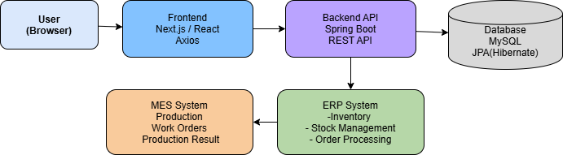
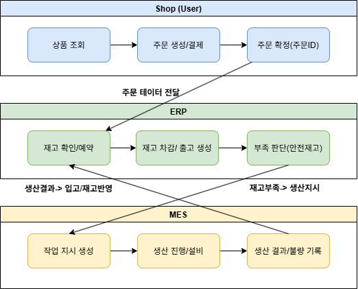
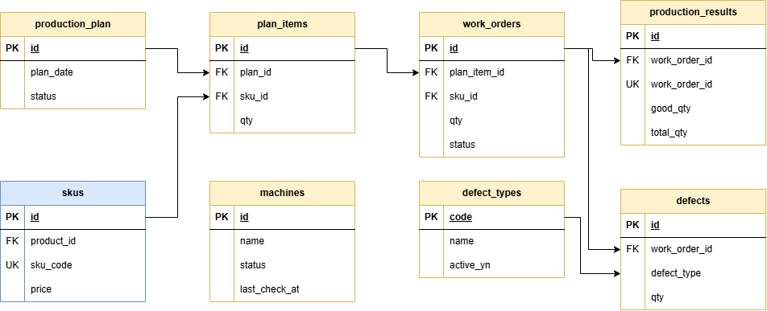

# 🏭 MES System (생산 관리 시스템)

---

## 📌 Overview

본 MES 시스템은 Shop–ERP–MES 통합 구조에서 **생산을 담당하는 시스템**으로,
재고 부족 상황을 자동으로 감지하고 생산 지시를 수행하여 재고를 보충하는 역할을 합니다.

👉 전체 흐름: **Shop → ERP → MES → ERP**

* Shop: 주문 발생
* ERP: 재고 차감 및 부족 감지
* MES: 생산 지시 및 결과 처리

👉 MES는 **재고 부족을 해결하는 자동 생산 시스템**입니다.

---

## 🧱 System Architecture

  

* Shop: 주문 및 결제
* ERP: 재고 관리
* MES: 생산 관리 (본 시스템)

👉 ERP에서 전달된 생산 요청을 기반으로 MES가 생산을 수행합니다.

---

## 🔄 Core Flow (생산 흐름)

  

### 📌 Production Flow

1. ERP에서 재고 부족 감지
2. MES로 WorkOrder(작업지시) 생성
3. 생산 계획 수립 (Production Plan)
4. 작업 지시 실행 (Work Order)
5. 생산 결과 등록 (Production Result)
6. ERP로 생산 결과 전달 → 재고 증가

👉 생산 → 재고 반영까지 자동 연결된 구조

---

## 🗂️ ERD (생산 관리 구조)

  

### 📌 핵심 엔티티

* **Production_Plan**: 생산 계획
* **Plan_Items**: 생산 대상 SKU
* **Work_Orders**: 작업 지시
* **Production_Results**: 생산 결과
* **Defects / Defect_Types**: 불량 관리
* **Machines**: 설비 관리

👉 생산 계획 → 작업 지시 → 생산 결과 흐름을 데이터로 관리

---

## ⚙️ Tech Stack

* Backend: Spring Boot, JPA
* Database: MySQL (Docker)
* Architecture: REST API

---

## 🧩 Key Features

### 1️⃣ 생산 계획 관리

* SKU 단위 생산 계획 수립
* 생산 일정 및 수량 관리

---

### 2️⃣ 작업 지시 (Work Order)

* ERP 요청 기반 자동 생성
* 작업 단위 생산 관리

---

### 3️⃣ 생산 결과 관리

* 생산 완료 수량 기록
* 생산 이력 관리

---

### 4️⃣ 불량 관리

* 생산 중 발생한 불량 기록
* 불량 유형 관리 및 분석 가능

---

### 5️⃣ ERP 연동

* ERP → MES 생산 요청 전달
* MES → ERP 생산 결과 전달 (재고 증가)

👉 시스템 간 자동 데이터 흐름 구현

---

## 🔥 Key Design

### ✔️ 이벤트 기반 생산 흐름

* 재고 부족 이벤트 → 생산 자동 트리거

---

### ✔️ SKU 기반 데이터 통합

* ERP와 동일한 SKU 기준으로 데이터 연결

---

### ✔️ 생산 프로세스 분리

* 계획 / 작업 / 결과 단계로 분리
* 유지보수 및 확장성 고려

---

## 🚀 Future Improvements

* 실시간 생산 모니터링 (Dashboard)
* 설비 상태 IoT 연동
* 생산 최적화 알고리즘 적용
* 불량 예측 모델 (ML)

---

## ✨ Summary

* ERP와 연동된 자동 생산 시스템
* 재고 부족 시 즉시 생산으로 연결
* 생산 데이터를 기반으로 운영 효율성 향상
