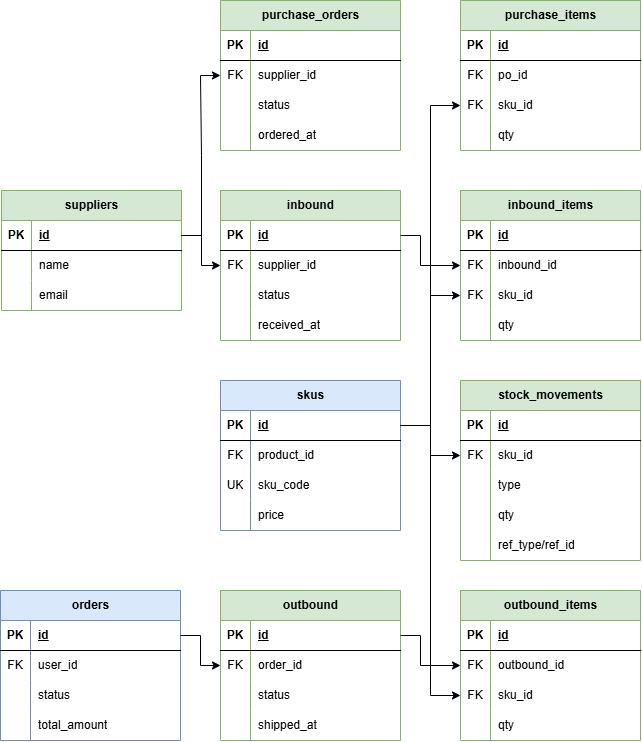

# 📦 ERP System (Shop 연동 재고 관리 시스템)

---

## 📌 Overview

본 ERP 시스템은 테니스 라켓 커머스 플랫폼(Shop)과 연동된 재고 관리 시스템으로,
주문 데이터를 기반으로 재고를 실시간으로 처리하고 MES 생산 시스템과 연결되는 **중앙 허브 역할**을 수행합니다.

👉 전체 구조: **Shop → ERP → MES**

---

## 🧱 System Architecture

  

* Shop: 주문 및 결제 처리
* ERP: 재고 관리 및 입출고 처리
* MES: 생산 관리

👉 ERP는 주문과 생산 사이의 데이터 흐름을 담당하는 핵심 시스템입니다.

---

## 🔄 Core Flow

  

### 📌 End-to-End 흐름

1. 사용자 주문 생성 및 결제
2. ERP에서 Outbound 생성 (출고)
3. 재고 차감 처리
4. 재고 부족 시 MES 생산 지시
5. 생산 완료 후 ERP Inbound 처리 (입고)
6. 재고 업데이트 및 출고 완료

👉 주문부터 생산까지 자동 연결된 구조

---

## 🗂️ ERD (Entity Relationship Diagram)

  

### 📌 핵심 구조

* SKU 기반 재고 관리
* 입고(Inbound) / 출고(Outbound) 중심 구조
* 재고 변동 이력 관리 (Stock Movement)

👉 모든 재고 흐름을 데이터로 추적 가능

---

## ⚙️ Tech Stack

* Backend: Spring Boot, JPA
* Database: MySQL (Docker)
* Architecture: REST API

---

## 🧩 Key Features

### 1️⃣ 재고 관리

* SKU 단위 재고 관리
* 실시간 재고 조회

### 2️⃣ 입출고 처리

* 주문 기반 자동 출고
* 입고 및 재고 반영

### 3️⃣ 재고 흐름 추적

* IN / OUT 기준 재고 변화 관리
* Stock Movement 기록

### 4️⃣ 시스템 연동

* Shop 주문 → ERP 재고 차감
* 재고 부족 → MES 생산 지시
* 생산 완료 → ERP 재고 반영

---

## 🔥 Key Design

### ✔️ SKU 기반 통합 구조

* 모든 시스템을 SKU 기준으로 연결

### ✔️ 트랜잭션 기반 처리

* 주문 → 재고 → 생산 흐름 일관성 유지

### ✔️ 중앙 재고 허브

* ERP에서 모든 재고 상태 관리

---

## 🚀 Future Improvements

* Kafka 기반 비동기 처리
* 자동 발주 시스템
* 실시간 KPI 대시보드
* ML 기반 수요 예측

---

## ✨ Summary

* Shop–ERP–MES를 연결하는 통합 시스템
* 재고와 생산이 자동으로 연동되는 구조
* End-to-End 데이터 흐름 기반 설계
